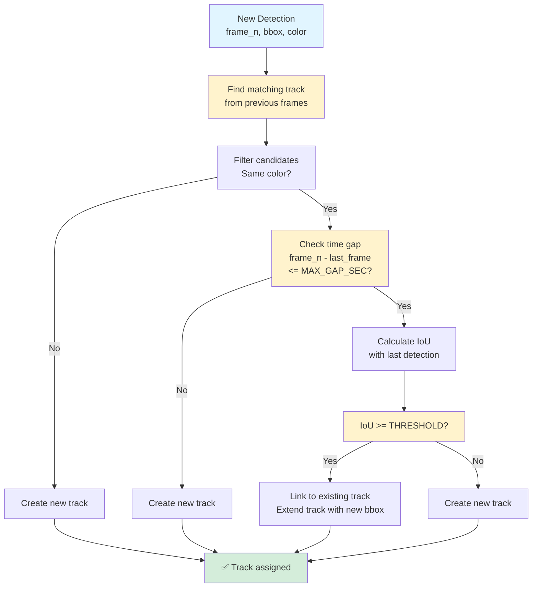
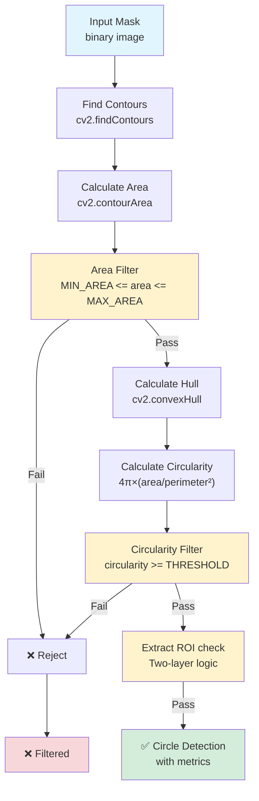
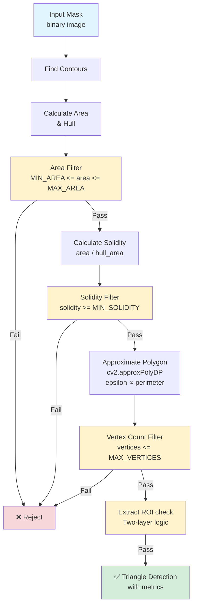
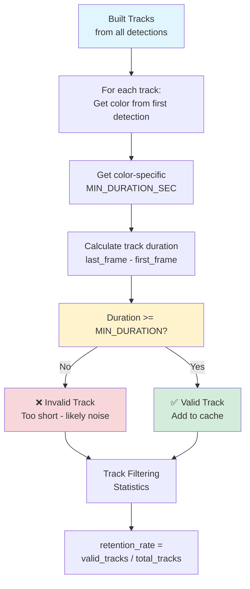
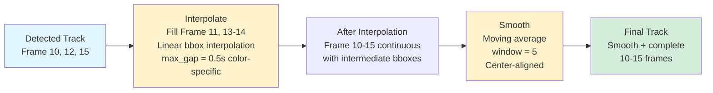
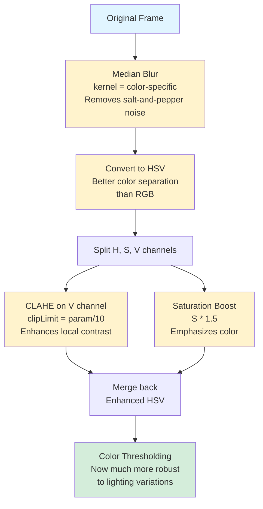
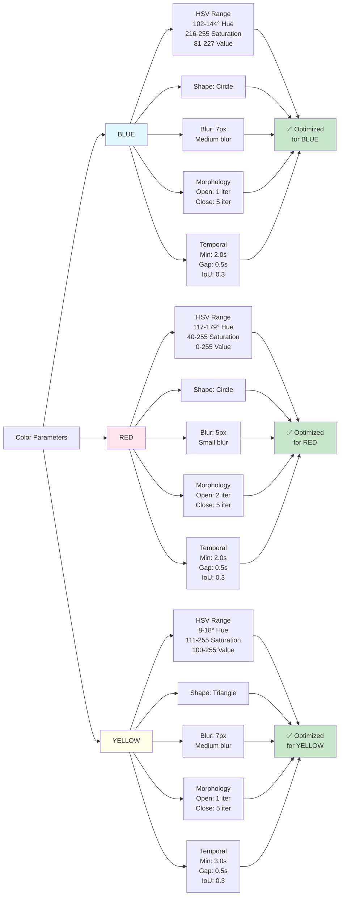
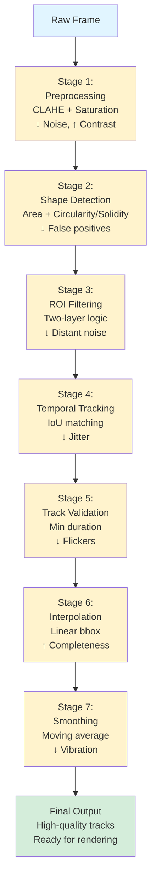

# Core Logic Diagrams - Traffic Sign Detection System

## 1. Two-Layer ROI Filtering Logic

```mermaida
%%{init: {'theme':'base', 'themeVariables': {'fontSize':'14px'}}}%%
graph TD
    A["Detected Shape<br/>area, bbox"] --> B["Is area >= TRUST_THRESHOLD?"]
    
    B -->|Yes| C["Trust Large Shapes<br/>Bypass ROI check<br/>Accept detection"]
    
    B -->|No| D["Is bbox inside ROI?<br/>overlap >= 50%"]
    
    D -->|Yes| E["Accept Small Shape<br/>in ROI"]
    
    D -->|No| F["Reject Shape<br/>Likely noise"]
    
    C --> G["✅ Valid Detection"]
    E --> G
    F --> H["❌ Filtered Out"]
    
    style A fill:#e1f5ff
    style G fill:#d4edda
    style H fill:#f8d7da
    style B fill:#fff3cd
    style D fill:#fff3cd
```

**Significance:** Balances sensitivity (small detections in ROI) with specificity (rejects distant noise)

---

## 2. Temporal Track Building - IoU Matching



**Significance:** Color-specific matching prevents blue circles from being linked with red circles. Gap threshold handles sign occlusion. IoU ensures spatial continuity.

---

## 3. Shape Detection Pipeline - Blue/Red Circles



**Significance:** 
- **Area filter**: Rejects noise (too small) and false positives (too large)
- **Circularity**: Distinguishes circles from irregular shapes
- **ROI + Trust threshold**: Handles both small precise detections and large confident detections

---

## 4. Shape Detection Pipeline - Yellow Triangles



**Significance:**
- **Solidity**: Ensures compact triangular shapes (rejects thin/elongated contours)
- **Polygon approximation**: Counts vertices to confirm triangular structure (3-7 vertices allowed)
- **Epsilon proportional to perimeter**: Adapts to different contour sizes

---

## 5. Track Validation & Filtering



**Significance:**
- **Color-specific validation**: Blue/Red signs have different temporal patterns than yellow
- **Min duration threshold**: Filters jittering/flickering false positives
- **Retention rate**: Indicates detection quality

---

## 6. Interpolation & Smoothing Strategy



**Significance:**
- **Interpolation**: Creates seamless tracks despite detection gaps
- **Color-specific max_gap**: Yellow can tolerate longer gaps than blue/red
- **Smoothing**: Reduces jitter in bbox coordinates for stable rendering

---

## 7. Frame Preprocessing Impact



**Significance:**
- **Median blur**: Noise reduction without blurring edges
- **HSV space**: More robust to shadows/lighting than RGB
- **CLAHE**: Adaptive histogram equalization - handles dark/bright regions
- **Saturation boost**: Makes colors pop for better thresholding

---

## 8. Color-Specific Parameters Impact - Version 1


**Significance:**

- Different colors need different processing
- Red has wider V range (handles both dark and bright red)
- Yellow tolerates longer gaps (may disappear longer in traffic)
- Morphology parameters tuned per color

---

## 8B. Color-Specific Parameters Impact - Version 2 (Detailed Comparison)



**Why Different Parameters:**

- **Blue**: Narrow V range (81-227) - consistent blue signs
- **Red**: Wider V range (0-255) - red varies light/dark
- **Yellow**: Higher min V (100) - yellow needs brightness
- **Yellow**: 3.0s min (longer than others) - yellow signs stay visible longer
- **Red**: Smaller blur (5px) - preserves fine red details
- **Circles vs Triangles**: Different shape validation criteria

---

## 9. End-to-End Quality Pipeline



**Significance:** Each stage filters out specific types of errors. The cascade approach is more robust than single-stage filtering.

---

## Summary - Key Logic Components

| Component | Purpose | Impact |
|-----------|---------|--------|
| **Two-Layer ROI** | Balance sensitivity/specificity | Reduces false positives while keeping real detections |
| **IoU Matching** | Track consistency | Links same sign across frames |
| **Color-Specific Params** | Adapt to sign properties | Each sign type detected optimally |
| **Interpolation** | Handle occlusions | Smooth tracks despite gaps |
| **Smoothing** | Reduce jitter | Stable bbox for rendering |
| **Validation** | Confirm real signs | Filters out noise and flickers |
| **CLAHE + Saturation** | Robust preprocessing | Works in varied lighting |
| **Shape metrics** | Distinguish objects | Circularity for circles, Solidity for triangles |
