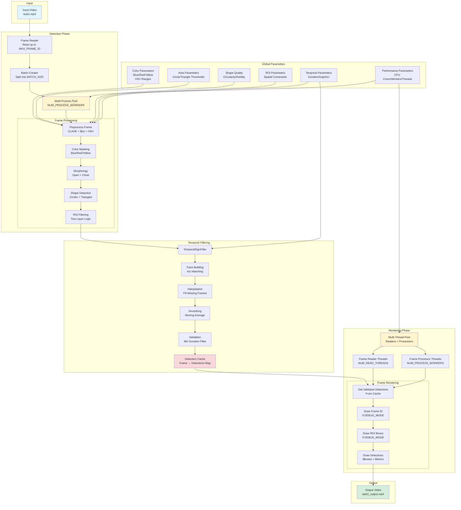
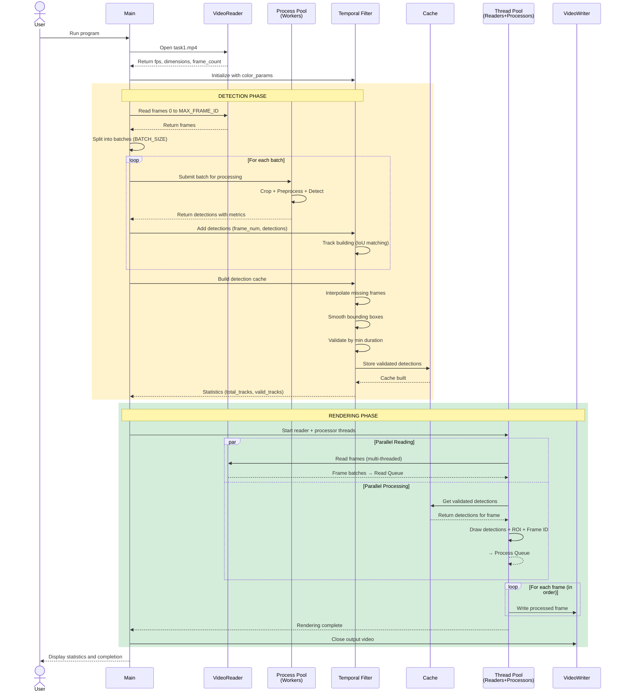
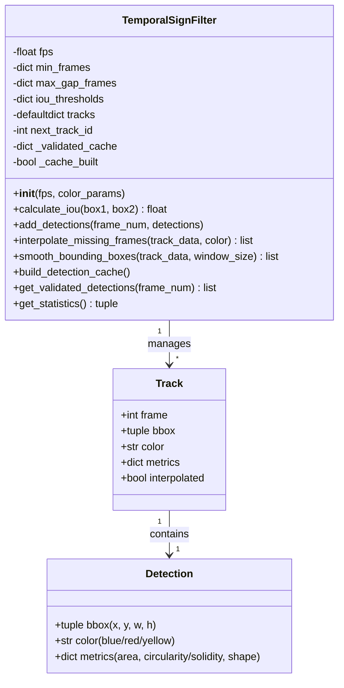
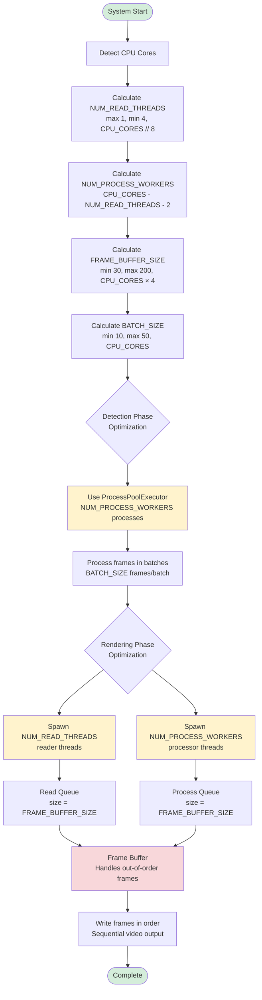

# Traffic Sign Detection System Diagrams

## Block Diagram - System Architecture

## Data Flow Diagram - Processing Pipeline

```mermaid
flowchart TD
    Start([Start]) --> LoadVideo[Load Video<br/>Get fps, width, height, total_frames]
    
    LoadVideo --> InitParams[Initialize Parameters<br/>- Color thresholds<br/>- Area limits<br/>- ROI regions<br/>- Temporal params]
    
    InitParams --> CreateFilter[Create TemporalSignFilter<br/>with color-specific params]
    
    CreateFilter --> DetectionPhase{Detection Phase}
    
    subgraph " "
        DetectionPhase --> ReadFrames[Read Frames 0 to MAX_FRAME_ID]
        ReadFrames --> SplitBatches[Split into Batches<br/>size = BATCH_SIZE]
        
        SplitBatches --> ParallelProcess[Parallel Processing<br/>NUM_PROCESS_WORKERS processes]
        
        ParallelProcess --> ProcessBatch[For Each Batch]
        
        ProcessBatch --> CropFrame[Crop Frame<br/>height_new = h × 0.475]
        
        CropFrame --> BlueDetect[Blue Channel:<br/>Preprocess → Mask → Morphology<br/>→ Extract Circles → ROI Filter]
        CropFrame --> RedDetect[Red Channel:<br/>Preprocess → Mask → Morphology<br/>→ Extract Circles → ROI Filter]
        CropFrame --> YellowDetect[Yellow Channel:<br/>Preprocess → Mask → Morphology<br/>→ Extract Triangles → ROI Filter]
        
        BlueDetect --> CombineDetections[Combine All Detections<br/>with metrics: area, circularity, solidity]
        RedDetect --> CombineDetections
        YellowDetect --> CombineDetections
        
        CombineDetections --> AddToFilter[Add to TemporalSignFilter<br/>frame_num, detections]
    end
    
    AddToFilter --> BuildTracks[Build Temporal Tracks<br/>- IoU matching<br/>- Gap filling<br/>- Color-specific thresholds]
    
    BuildTracks --> InterpolateGaps[Interpolate Missing Frames<br/>Linear interpolation of bbox]
    
    InterpolateGaps --> SmoothTracks[Smooth Bounding Boxes<br/>Moving average window=5]
    
    SmoothTracks --> ValidateTracks[Validate Tracks<br/>Filter by min duration<br/>color-specific]
    
    ValidateTracks --> BuildCache[Build Detection Cache<br/>Map: frame_num → validated_detections]
    
    BuildCache --> Stats[Get Statistics<br/>total_tracks, valid_tracks]
    
    Stats --> RenderingPhase{Rendering Phase}
    
    subgraph "  "
        RenderingPhase --> ReadAllFrames[Read ALL Frames 0 to total_frames]
        
        ReadAllFrames --> MultiThread[Multi-Threading<br/>NUM_READ_THREADS readers<br/>NUM_PROCESS_WORKERS processors]
        
        MultiThread --> ReadQueue[Reader Threads<br/>→ Read Queue]
        MultiThread --> ProcessQueue[Processor Threads<br/>→ Process Queue]
        
        ReadQueue --> GetFromCache[Get Validated Detections<br/>from Cache for frame_num]
        ProcessQueue --> GetFromCache
        
        GetFromCache --> CheckDebug{DEBUG_MODE?}
        
        CheckDebug -->|Yes| DrawFrameID[Draw Frame ID]
        CheckDebug -->|Yes| DrawROI[Draw ROI Boxes<br/>Blue/Red/Yellow]
        CheckDebug -->|No| DrawDetections[Draw Detections Only]
        
        DrawFrameID --> DrawROI
        DrawROI --> DrawDetectionsDebug[Draw Detections<br/>+ Area + Circularity/Solidity]
        
        DrawDetectionsDebug --> WriteFrame[Write Frame to Output]
        DrawDetections --> WriteFrame
        
        WriteFrame --> FrameBuffer[Frame Buffer<br/>Reorder if needed]
    end
    
    FrameBuffer --> SaveVideo[Save Output Video<br/>task1_output.mp4]
    
    SaveVideo --> PrintStats[Print Statistics<br/>- Processing time<br/>- FPS<br/>- Track retention]
    
    PrintStats --> End([End])
    
    style Start fill:#d4edda
    style End fill:#d4edda
    style DetectionPhase fill:#fff3cd
    style RenderingPhase fill:#fff3cd
    style BuildCache fill:#f8d7da
    style ParallelProcess fill:#ffeaa7
    style MultiThread fill:#ffeaa7
```

## Sequence Diagram - Two-Phase Processing

## Class Diagram - TemporalSignFilter

## Component Interaction Diagram

```mermaid
graph LR
    subgraph "Input Layer"
        A[Video File<br/>task1.mp4]
    end
    
    subgraph "Processing Layer"
        B1[Frame Preprocessing<br/>CLAHE + HSV]
        B2[Color Segmentation<br/>Thresholding]
        B3[Morphological Ops<br/>Open + Close]
        B4[Shape Detection<br/>Contours]
        B5[ROI Validation<br/>Two-Layer]
    end
    
    subgraph "Tracking Layer"
        C1[IoU Matching]
        C2[Track Building]
        C3[Interpolation]
        C4[Smoothing]
        C5[Validation]
    end
    
    subgraph "Cache Layer"
        D1[Detection Cache<br/>frame → detections]
    end
    
    subgraph "Rendering Layer"
        E1[Frame Reading]
        E2[Cache Lookup]
        E3[Drawing]
        E4[Video Writing]
    end
    
    subgraph "Output Layer"
        F[Output Video<br/>task1_output.mp4]
    end
    
    A --> B1
    B1 --> B2
    B2 --> B3
    B3 --> B4
    B4 --> B5
    B5 --> C1
    C1 --> C2
    C2 --> C3
    C3 --> C4
    C4 --> C5
    C5 --> D1
    D1 --> E2
    E1 --> E2
    E2 --> E3
    E3 --> E4
    E4 --> F
    
    style A fill:#e1f5ff
    style D1 fill:#f8d7da
    style F fill:#d4edda
```

## Performance Optimization Flow

