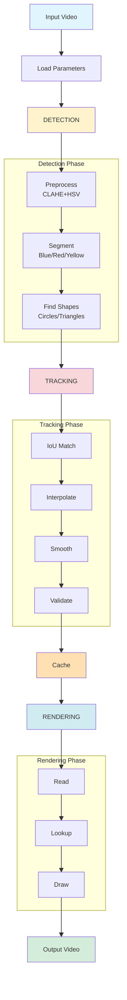

# Overall System Flow Diagram (A4 Format)

```mermaid
%%{init: {'flowchart': {'curve': 'linear'}, 'theme': 'default', 'themeVariables': { 'fontSize': '12px'} }}%%
graph TD
    A["Input Video"] --> B["Load Parameters"]
    
    B --> C["DETECTION"]
    
    subgraph Detection["Detection Phase"]
        D1["Preprocess<br/>CLAHE+HSV"]
        D2["Segment<br/>Blue/Red/Yellow"]
        D3["Find Shapes<br/>Circles/Triangles"]
        D1 --> D2 --> D3
    end
    
    C --> D1
    D3 --> E["TRACKING"]
    
    subgraph Tracking["Tracking Phase"]
        E1["IoU Match"]
        E2["Interpolate"]
        E3["Smooth"]
        E4["Validate"]
        E1 --> E2 --> E3 --> E4
    end
    
    E --> E1
    E4 --> F["Cache"]
    
    F --> G["RENDERING"]
    
    subgraph Rendering["Rendering Phase"]
        G1["Read"]
        G2["Lookup"]
        G3["Draw"]
        G1 --> G2 --> G3
    end
    
    G --> G1
    G3 --> H["Output Video"]
    
    style A fill:#e1f5ff
    style H fill:#d4edda
    style C fill:#fff3cd
    style E fill:#f8d7da
    style G fill:#d1ecf1
    style F fill:#ffe0b2
```

**Flow:** Input → Detect signs in frames → Track across frames → Render output
